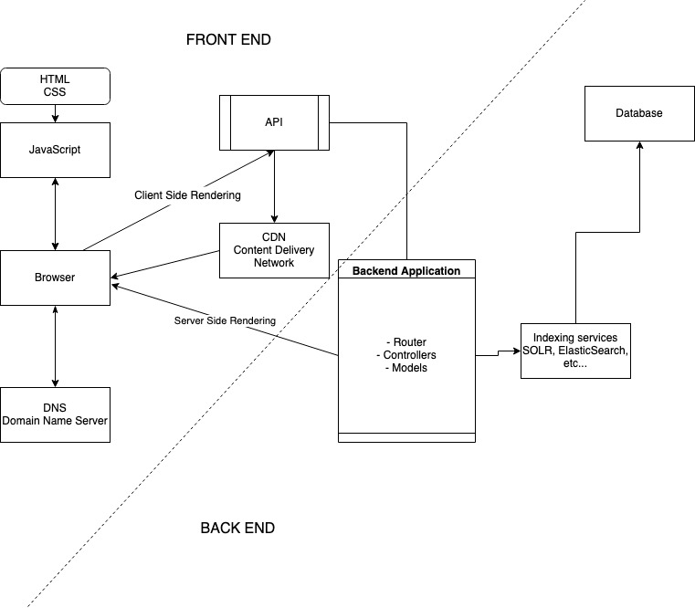

# Week 1 Note 1

---

# Homework

https://jsfiddle.net/mreigen/qbkhyoz0/1/

---

# HTML

HTML stands for **Hyper Text Markup Language** which is used for creating web pages and web applications.

A basic web page needs at least the `html` tag, `head` tag and `body` tag as below:

```html
<html>
  <head></head>
  <body></body>
</html>
```

Inside the head tag is where you want to insert your links to your CSS (styling) files, title of the page, link to import code from other script files (JavaScript files), meta tags to help with SEO! (see in `index.html`), your favorite icon, etc...

See all elements that can be used within a `head` here https://developer.mozilla.org/en-US/docs/Web/HTML/Element/head#see_also

## Tags

HTML tags are like keywords which defines that how web browser will format and display the content. With the help of tags, a web browser can distinguish between an HTML content and a simple content. HTML tags contain three main parts: opening tag, content and closing tag.

```html
<html>
  Top level tag
</html>
<div>Division Tag</div>
<p>Paragraph Tag</p>
<h2>Heading Tag</h2>
<b> Bold Tag </b>
<i> Italic Tag </i>
<u> Underline Tag</u>
<script>
  Script inside here
</script>
```

Tags can be nested:

```html
<div class="header">
  <h1>MY VACATIONS</h1>
  <div>Another div
    <p>A paragraph</p>
    <span>blah<span>
  </div>
</div>
```

See the whole list of HTML Tags [here](https://developer.mozilla.org/en-US/docs/Web/HTML/Element)

## Class

The class global attribute is a space-separated list of the case-sensitive classes of the element. Classes allow CSS and Javascript to select and access specific elements via the class selectors or functions like the DOM method document.getElementsByClassName.

```html
<div class="pictures">
  
</div>
```

## ID

Id of a DOM element is to identify the element from others. Id must be unique from other ids on the same page.

```html
<div id="my-id-1"></div>
<div id="my-id-2"></div>
<div id="my-id-3"></div>
```

## Event handlers

Event handlers are used to hook up JS functions with the DOM objects (created by tags). For example, I want to hook up function `showNextImage()` with a `<button/>`. I would add `onClick="showNextImage()"` like below:

```html
<button onclick="showNextImage()">Next</button>
```

and below this line, I will create a JS function named `showNextImage()` (inside a `<script type="javascript">`)

```js
<script language="javascript">
  function showNextImage() {
    ...
  }
</script>
```

Now everytime I click on the `<button/>`, the `showNextImage()` function gets invoked.

You can also hook up other events like `onchange` to detect changes on an input. This is useful when you have a text input and want to capture what users are typing in it. For example, when users are typing their email address, you want to validate if the email is in valid format.

```html
<input type="text" onchange="validateEmailAddress()" />

<script language="javascript">
  function validateEmailAddress(e) {
    // the input value can be read by e.target.value
    const emailAddress = e.target.value;
    // validates email
    ...
  }
</script>
```

# CSS

CSS stands for Cascade Style Sheet which is used to determine what styles (colors, alignment, margin, padding, etc...) a DOM element should have. You can define your custom styles in CSS. It can be in the same file with your HTML code or from a separate file to be imported to your HTML file.

To decide which DOM element to be styled, you can select by **class**, by **id** or by **element tag name**:

##### By class

```html
<div class="my-class-name"></div>
```

```css
// note the DOT in front of the class name
.my-class-name {
  // styling goes here
}
```

##### By Id

```html
<div id="my-id"></div>
```

```css
// use POUND SIGN for ID
#my-id {
  // styling goes here
}
```

##### By tag name

```html
<div id="my-id-1"></div>
<div id="my-id-2"></div>
<div id="my-id-3"></div>
```

```css
// ALL div elements on the page will use this styling
div {
  // styling goes here
}
```

Learn more about CSS here: https://developer.mozilla.org/en-US/docs/Learn/CSS/First_steps/Getting_started

## JavaScript

This week we are learning the following concept in "vanilla" JavaScript. Please look at the `index.html` file again and review these concepts.

- Variable definitions: `var` vs `let` vs `const`
- Variable value assignment
- Create and use a function
- Create and access an array
- "Get" a reference to a DOM element in the page
- Change the attribute value of a DOM element in the page
- Basic `if` statement
- `===` vs `==`
- shorthand `+=` and `-=`
- Print (log) values to dev console

---

# Real work knowledge (RWK)

Introduction to relationship between front and back ends



https://drive.google.com/file/d/11rBDP79ktJIQ-vk2I_7mS6B81DheqVMa/view

---

## Slack me if you have any questions!

---
